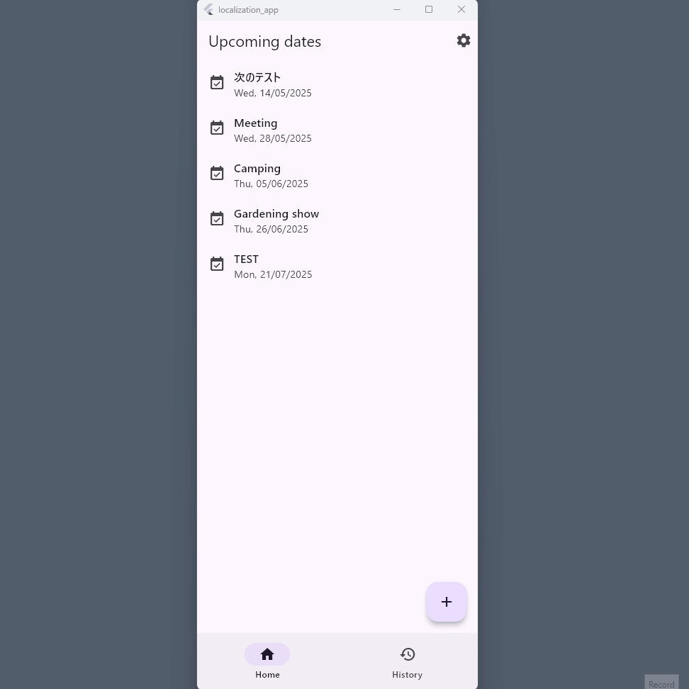

# Flutter: Localization demo app

This is a Flutter project that demonstrates how to implement localization/internationalization (change the language used in the app as per the user's choice) in Flutter.

The original project is [Flutter local storage demo app using Drift](https://github.com/ChiekoN/Flutter-local_storage_app), and I added the following features:
 
 - *Settings* page was added. It opens from Settings icon (<i class="material-icons">settings</i>) on the right side of the app bar.

 - In *Settings* page, a user can choose a locale (language) from a dropdown menu. In this app, English and Japanese are available.


**NOTE:**
In this app, the title and the memo area retain what a user inputs just as is. Users can input text by their language and not be translated when they change the locale. 



## Key techniques

### 1. Localization/Internationalization

#### 1-1. Internationalizing labels/messages

In this project, I made this app available in two languages: English and Japanese. Messages and labels can be displayed in English/Japanese based on the user's selection or the device setting. When the language being set on the device is other than English/Japanese, this app automatically selects English as the default language.

To implement internationalization, I followed the procedure written in Flutter official documentation:
 - [Internationalizing Flutter apps](https://docs.flutter.dev/ui/accessibility-and-internationalization/internationalization)

Packages:
 - flutter_localizations
 - [intl](https://pub.dev/packages/intl)


#### 1-2. Date Format

In English, different date formats are used in different countries. In American English, it is MM/DD/YY format, while DD/MM/YY format is used in British English (in Australia as well).

In order to handle this, I set app's `Locale` with both *language* and *region* (not `Locale('en')`, but `Locale('en', 'GB')` for example), and used `DateFormat` to format date strings in the appropriate locale.

Documentation:
- [DateFormat class](https://api.flutter.dev/flutter/intl/DateFormat-class.html)


### 2. Settings page

Widgets:
 - `Dialog` class and `showDialog()` function: [Dialog class](https://api.flutter.dev/flutter/material/Dialog-class.html)

 NOTE: Settings doesn't persist in local storage in this project.


### 3. State management

The app's locale is set to the `locale` property in `MaterialApp`, which is the root widget of this app. To make the new locale selected in Settings page effective to the whole application, there should be an appropriate state management. Here I used `Bloc(Cubit)`, because of the history of the project and potential for scalability.

Documentation:
 - [Bloc](https://bloclibrary.dev/)

Package:
 - [flutter_bloc](https://pub.dev/packages/flutter_bloc)

### 4. Equatable

I created a custom class (`UserConfig`) that is supposed to manage a user's app setting. At the moment, it has only `locale`, but potentially it could have more properties. And when a class like this is used as **state** to be managed, it has to be **equatable**. It means when there are two objects of the class, it has to be possible to compare them and judge if they are equivalent. I extended `Equatable` class to create the custom state class to make it equatable.

Package:
  - [equatable](https://pub.dev/packages/equatable)


## Code
```
lib
 ┣ data
 ┃ ┣ models
 ┃ ┃ ┣ data_todate.dart
 ┃ ┃ ┗ data_todate.g.dart
 ┃ ┗ repository
 ┃ ┃ ┣ data_todate_repo.dart
 ┃ ┃ ┗ data_user_config_repo.dart  // Data repository for user settings
 ┣ domain
 ┃ ┣ models
 ┃ ┃ ┣ todate.dart
 ┃ ┃ ┗ user_config.dart  // Class definition for user settings 
 ┃ ┗ repository
 ┃ ┃ ┣ todate_repo.dart
 ┃ ┃ ┗ user_config_repo.dart   // Repository for user settings 
 ┣ feature
 ┃ ┣ pages
 ┃ ┃ ┣ add
 ┃ ┃ ┃ ┗ add.dart
 ┃ ┃ ┣ detail
 ┃ ┃ ┃ ┣ date_area.dart
 ┃ ┃ ┃ ┣ detail.dart
 ┃ ┃ ┃ ┣ history_detail.dart
 ┃ ┃ ┃ ┗ memo_area.dart
 ┃ ┃ ┣ history
 ┃ ┃ ┃ ┗ history.dart
 ┃ ┃ ┣ settings   // Settings page
 ┃ ┃ ┃ ┗ settings.dart
 ┃ ┃ ┗ toplist
 ┃ ┃ ┃ ┗ toplist.dart
 ┃ ┗ shared
 ┃ ┃ ┣ app.dart
 ┃ ┃ ┣ bottom_navbar.dart
 ┃ ┃ ┣ router.dart
 ┃ ┃ ┣ todate_cubit.dart
 ┃ ┃ ┣ todate_provider.dart
 ┃ ┃ ┣ todate_rootview.dart
 ┃ ┃ ┗ user_config_cubit.dart // Cubit for Settings state management
 ┣ l10n  // For localization
 ┃ ┣ app_en.arb
 ┃ ┣ app_ja.arb
 ┃ ┣ app_localizations.dart
 ┃ ┣ app_localizations_en.dart
 ┃ ┗ app_localizations_ja.dart
 ┗ main.dart
 ```

## Platform

In development, I selected Windows app as my target device.

## Flutter resources

A few resources to get you started if this is your first Flutter project:

- [Lab: Write your first Flutter app](https://docs.flutter.dev/get-started/codelab)
- [Cookbook: Useful Flutter samples](https://docs.flutter.dev/cookbook)

For help getting started with Flutter development, view the
[online documentation](https://docs.flutter.dev/), which offers tutorials,
samples, guidance on mobile development, and a full API reference.
